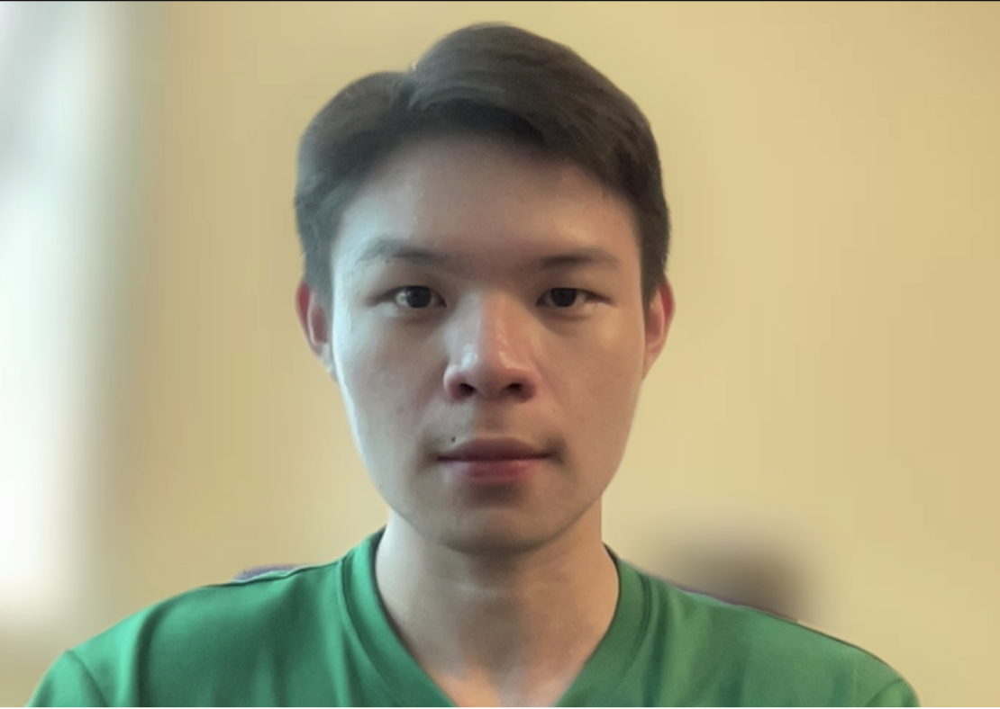
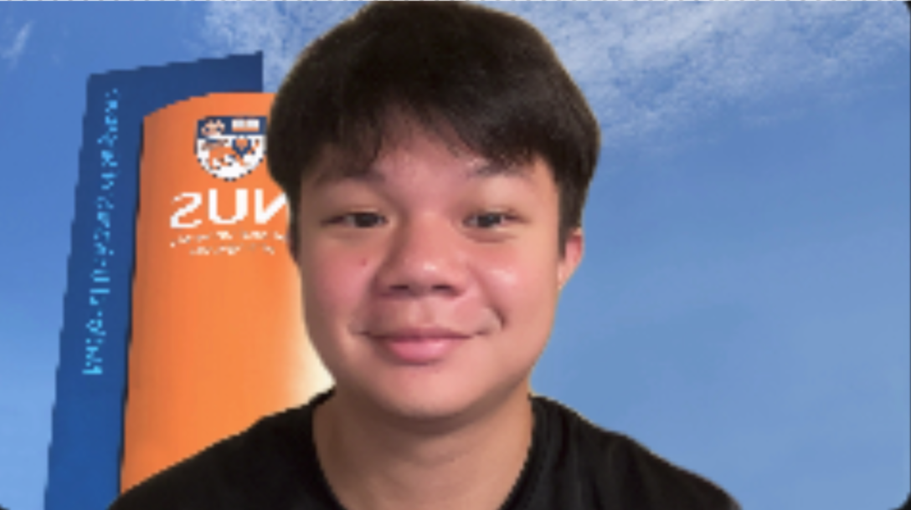
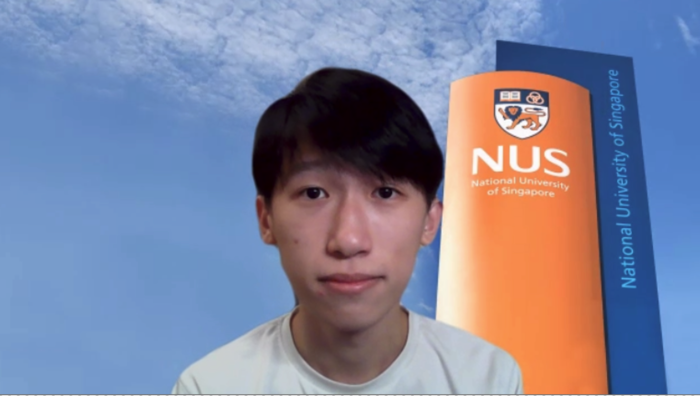

# About Us

We are a team based in the [School of Computing, National University of Singapore](http://www.comp.nus.edu.sg).

You can reach us at the email `nidhish.k[at]comp.nus.edu.sg`

## Project team

### Nidhish Krishnan

[[github](http://github.com/nid21cs)]
[[portfolio](team/nid21cs.md)]

* Role: Developer
* Responsibilities: Team lead + Scheduling and tracking

### Ng Chun Man

[[github](http://github.com/ngchunman)]
[[portfolio](team/ngchunman.md)]

* Role: Team Lead
* Responsibilities: Documentation + Deliverables and deadlines

### Ching Ming Yuan

[[github](http://github.com/mingyuanc)]
[[portfolio](team/mingyuanc.md)]

* Role: Developer
* Responsibilities: Testing + IntelliJ expert

### Loo Mei Lin Zann

[[github](http://github.com/zannloo)]
[[portfolio](team/zannloo.md)]

* Role: Developer
* Responsibilities: Code quality + General admin

### Nereus Ng Wei Bin

[[github](http://github.com/nereuswb922)]
[[portfolio](team/nereuswb922.md)]

* Role: Developer
* Responsibilities: Integration + Git expert
