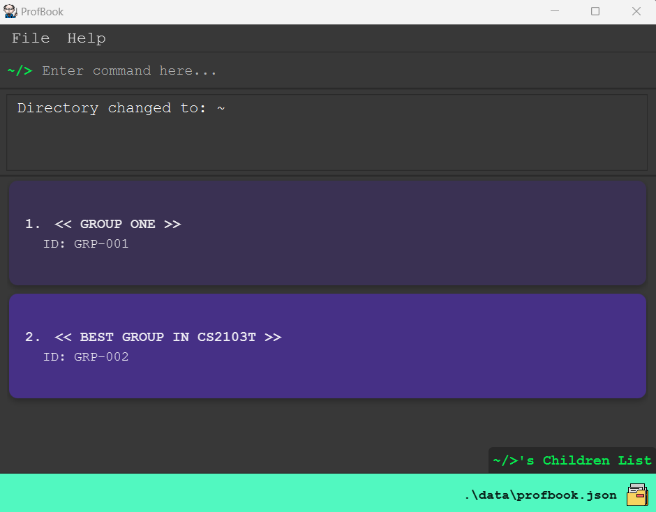
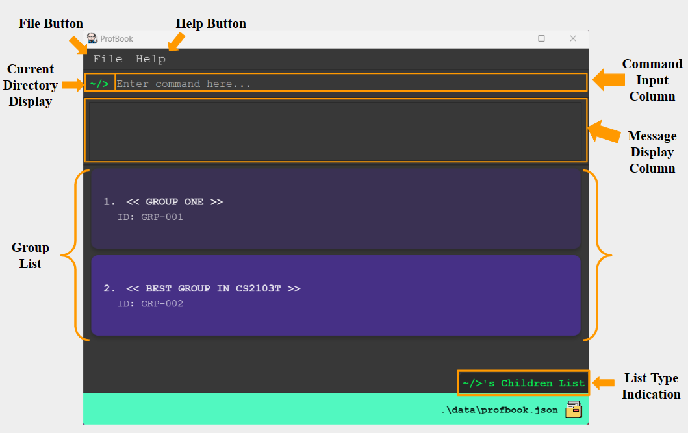
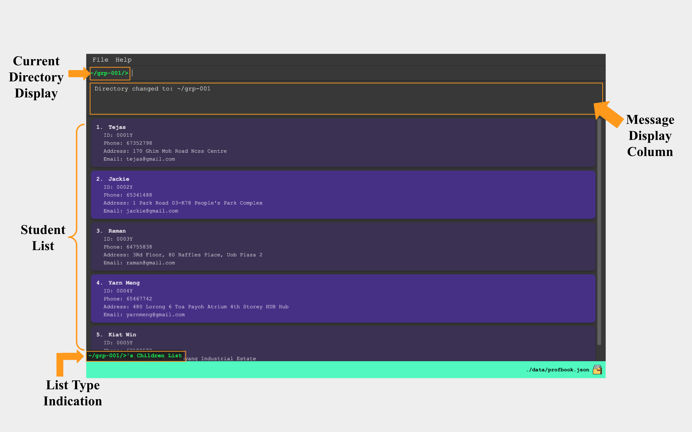
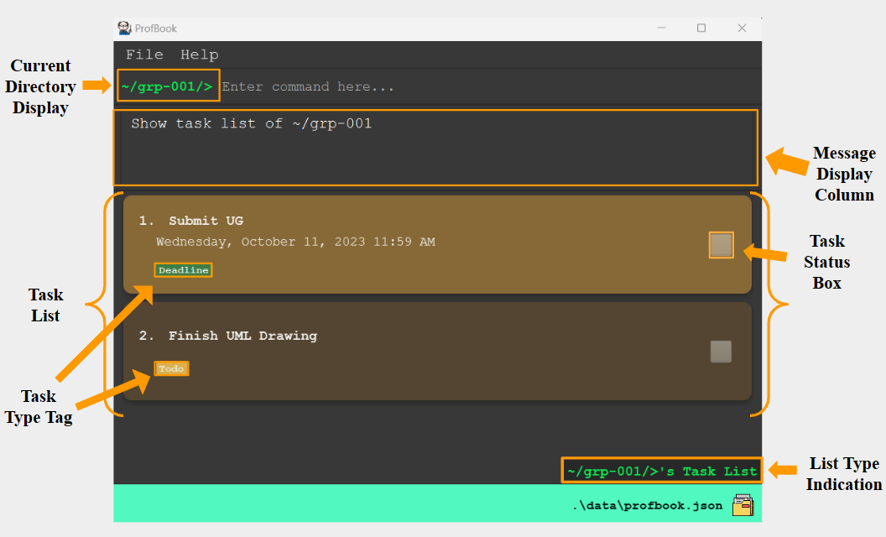
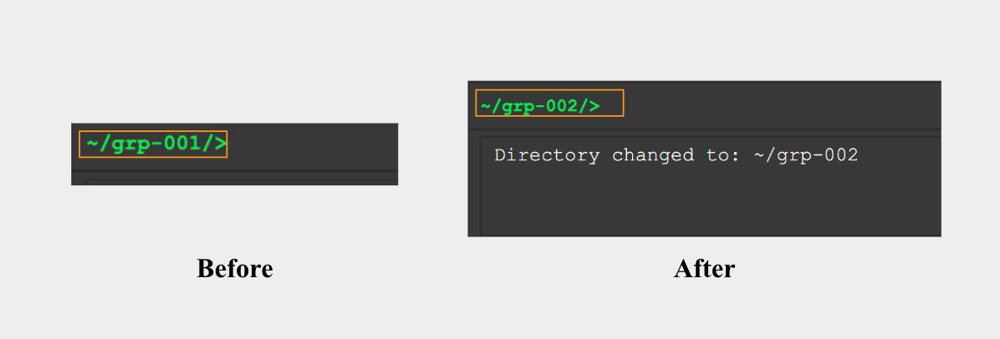
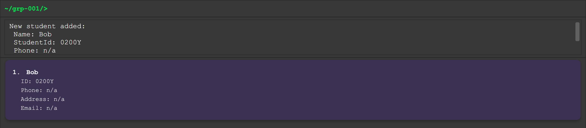
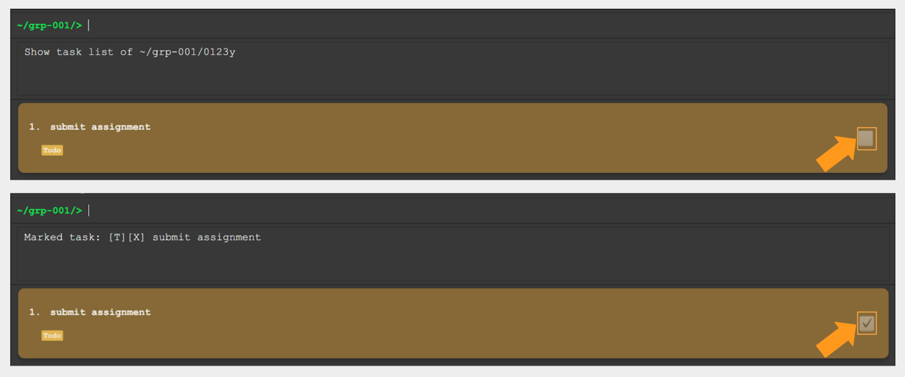

# ProfBook User Guide :bulb:

Welcome to ProfBook, a specialised **student management system** exclusively tailored for **CS2103T tutors** by CS2103T 
students.  This guide is your gateway to unlocking the potential of ProfBook, where you will discover how ProfBook can 
help streamline your administrative tasks, alleviate workload and most importantly reduce any administrative errors.

## What can ProfBook do :raising_hand:
As current students of CS2103T, we understand that CS2103T tutors have a high administrative workload on top of their 
existing tutor duties. On top of that, any administrative mistakes or oversights can increase that workload 
exponentially and may adversely impact student's learning. We deeply appreciate your role, and it is precisely to 
address these aforementioned issues that we designed ProfBook. ProfBook aims to
**drastically decrease administrative mistakes and your workload**.

ProfBook is optimized for tutors' use via a **familiar Command Line Interface (CLI) that uses linux-styled commands** 
while retaining the benefits of a Graphical User Interface (GUI). If you are a fast typer, ProfBook will empower you 
to efficiently track and manage students' progress and tasks, surpassing the capabilities of traditional GUI apps 
with a gentle learning curve.
  
---  

## Features overview

### Consolidated Information

As a project-based module, CS2103T tutors have to juggle multiple groups. ProfBook
aims to expedite this process by allowing you to keep track of all your groups and their progress within a centralised 
location. You would be able to traverse between the different groups quickly through familiar Linux commands.

### Student and Group Management

ProfBook aids with the **management of student and group information**. ProfBook efficiently encapsulates information of 
every project group so that you can easily monitor their progress and relevant information.  You can 
effortlessly **add, delete and edit students or groups** and even **move students from one group to another**.

### Task Management

In addition to the efficient management of student and group information, ProfBook also aids with the 
**management of task information**.  You can quickly and seamlessly **allocate tasks to specific student or group** 
and track their progress. With ProfBook, you can easily monitor each stage of the task journey, 
from start to finish, ensuring optimal productivity.

    <!-- Content that will start on a new printed page -->

<!-- * Table of Contents -->

  <page-nav-print>

  **Table of Contents**

  </page-nav-print>

---

    <!-- Content that will start on a new printed page -->

## Quick start

The following steps are similar for all operating systems(OS) such as Windows, macOS and Linux.

1. Ensure you have Java `11` or above installed in your computer.

1. Download the latest `ProfBook.jar` from [here](https://github.com/AY2324S1-CS2103T-W15-2/tp/releases).

1. Copy the file to the folder you want to use as the _home folder_ for your ProfBook.

1. Open a command terminal, `cd` into the folder you put the jar file in, and use the `java -jar ProfBook.jar` command
   to run the application. 
   A GUI similar to the below should appear in a few seconds. Note how the app contains some sample data. 
   

      {width=400 height=200}

   

1. Type the command in the command box and press Enter to execute it.
     Some example commands you can try:

    - `cat grp-001` : Lists all tasks belonging to grp-001.

    - `touch grp-001/0123Y --name Bob`
      : Adds a student named `Bob` to the grp-001.

    - `rm grp-001` : Deletes grp-001.

1. Refer to the [General Commands](#general-commands), [Student or Group Commands](#student-or-group-commands), [Tasks Commands](#tasks-command) below for details of each command.

---

    <!-- Content that will start on a new printed page -->

## How to use the User Guide :heart_eyes:
We understand that it may be daunting to delve into a completely new user guide. This section is designed
to make this journey more smooth sailing for you and enhance your understanding of the commonly used icons and boxes.
We hope you enjoy your reading experience! :blush: :book:

<box type="info">

**Light blue boxes** like this with an **"i" icon** are designated for information-related content.
</box>

<box type="tip">

Keep a look-out for **green boxes** like this with a **light bulb icon**, they provide valuable suggestions on
how you can better make use of the commands for greater efficiency and convenience once you have mastered
the basics of the command.
</box>

<box type="warning">

When you come across **yellow boxes** like this with a **"!" icon**, do take extra note and caution!  
It contains crucial cautionary information that is definitely a **must read**.
</box>

<box type="success" seamless>

This is utilized to indicate the output if command succeeds.:ok_woman:

</box>

<box type="wrong" seamless>

This is utilized to indicate the output if command fails.:no_good:

- Please note that only the **relevant outputs** for the command are indicated. There may be additional outputs
  in the case of command failure that are not indicated.
- For more information and solutions on commonly made mistakes, feel free to click [here](#commonly-made-mistake)!

</box>

---

    <!-- Content that will start on a new printed page -->

## Understanding ProfBook :books:

### ProfBook Folder Structure

ProfBook is organized hierarchically with the following structure:

  <tree>
  ~/
    grp-001/
      1001Z
      4123U
    grp-002/
      5815Y
    grp-003/
      ...
  </tree>

  **Root Directory (e.g., `~/`)** 
  The Root Directory serves as the main container for the ProfBook software. This is where all the data is organized.

  **Group Directories (e.g., `grp-001`, `grp-002`, ...)** 
  Within the Root Directory, there are Group Directories only. Each Group Directory is dedicated to managing a specific group of students.

**Student Directories (e.g., `1001Z`, `5815Y`, ...)** 
  Inside each Group Directory, you'll find Student Directories only. These directories represent individual students 
within each group.

  This hierarchical structure enables a well-organized and efficient way to manage groups and students within ProfBook.

### ProfBook Command Format

- Words in `UPPER_CASE` are the **compulsory** parameters to be supplied by you.
  * e.g. In `touch SPECIFIED_PATH -n NAME`, `SPECIFIED_PATH` and the other field in `UPPER_CASE` can be substituted 
  with the desired details to form `touch 2000Y --name Bob`.
* Words in `UPPER_CASE` that are surrounded by `[square brackets]` are **optional** parameters to be supplied by you.
  * e.g. In `cat [SPECIFIED_PATH]`, `[SPECIFIED_PATH]` can be substituted with details or left empty, 
      `cat 2000Y` and `cat` are acceptable commands.
- Parameters can be in any order.
  * e.g. If the command specifies `-n NAME -e EMAIL`, `-e EMAIL -n NAME` is also acceptable.
* Extraneous parameters for commands that do not take in parameters (such as `help`, `exit` and `clear`) will be ignored. 
  * e.g. If the command specifies `help 123`, it will be interpreted as `help`.
- Regarding the detection of duplicates,
  - **For students and groups**, duplicates can only be detected if they share the same StudentId or GroupId respectively
  across ProfBook. 
  - **For Todo tasks**, duplicates can only be detected if the todo tasks share the same
      description (`DESCRIPTION`).
  - **For Deadline tasks**, duplicates can only be detected if the deadline tasks share the same 
  description (`DESCRIPTION`) and due date (`DATE_AND_TIME`).
* If you would like to pass in a field that starts with `\`, `-` or `--`, you would need to use `\` before the start of
that field. 
  * Else, fields that start with `-` or `--` will be treated as [flags](#flags) and fields that start with `\`
  will be treated without `\`(`\Orchard` when inputted will be treated as `Orchard`).
    * e.g. To pass in `-Clementi` in the `edit` command, the command would be `edit -a \-Clementi`.

<box type="warning">

If you are using a PDF version of this document, please be careful when copying and pasting commands that span 
multiple lines as space characters surrounding line-breaks may be omitted when copied over to the application.
 </box>

### Flags :triangular_flag_on_post::triangular_flag_on_post::triangular_flag_on_post:
All flags begin with `--` or `-`.
Flags usually **come before** essential details required by the command and are compatible in both long and short forms:

- `--name` / `-n` followed by the name of student or group as specified by command.
* `--email` / `-e` followed by the email of student. 
- `--phone` / `-p` followed by the phone number of student.
* `--address` / `-a` followed by the address of student.
- `--id` / `-i` followed by a `STUDENT_ID` or `GROUP_ID` as specified by the command.
* `--desc` / `-d` followed by the description of task specified by command.
- `--datetime` / `-dt` followed by the due date of a deadline task in the `yyyy-MM-dd HH:mm` format. 

* `--all` / `-al` followed by either: 
  - `allStu` which adds **individual** tasks to all students within the specified directory.
    - Can only be used at a group or root directory.  
      - If used at **group directory**, task will be added to **all students in that group**.
      - If used at **root directory**, task will be added to **all students in ProfBook**.
  - `allGrp` which adds **group** tasks to all groups within the root directory.
    - Can only be used at root directory.
- `--help` / `-h`
  - Use with any command (except `exit`, `help` and `clear`) for more information.
  - e.g. `touch --help` to learn more about how to add a student to ProfBook.

### Acceptable values for each parameter

`SPECIFIED_PATH`:
- Must be a **valid** path. 
- Most commands will require the `SPECIFIED_PATH` to be a present path (path that currently exists within ProfBook)
except for the [`touch`](#add-a-student-touch) and [`mkdir`](#add-a-goup-mkdir) commands.

| **Symbol** | **Purpose of symbol**                                                                                                                                                                                 |
|------------|-------------------------------------------------------------------------------------------------------------------------------------------------------------------------------------------------------|
| `..`       | Step up one level from the current directory.   e.g. when executing [`cd ..`](#change-directory-cd) at the group directory, you will move up to the root directory.                                |
| `.`        | Stays as current directory.                                                                                                                                                                           |
| `/`        | Between every type of directory (Root, Group and Student), it will be separated by `/`.   This format ensures a clear and consistent representation, which aligns with the familiar Linux command. |
|`~`| Represents the root directory.                                                                                                                                                                        | 

<box type="info">

To begin writing a **valid** path, start with the directory you can and intend to navigate. Alternatively, you can always 
commence from the root directory, `~/`, and define your path as the route leading from the root directory to your desired directory.

Kindly note that **direct navigation between directories of the same type is not permitted**. 
You would need to navigate up by at least one directory before moving to the desired directory.  
e.g. use `../grp-001` to navigate up to the root directory first before navigating to the `grp-001` group directory 
from another group directory. 

Additionally, **skipping directories between other directories is not allowed**. For instance, to navigate from the root directory
to a student directory, `0123Y`, where the student directory is within group directory, `grp-001`,
you would need to utilize `~/grp-001/0123Y` and **not** `~/0123Y`.
 </box>

`NAME`:
- Must be a non-empty string that only contain alphanumeric characters and spaces.
- This means that you cannot input a blank field. 

`EMAIL`:
- Must be a non-empty string following the format of `local-part@domain`.
  - `local-part`:
    - Should only contain alphanumeric characters and special characters, 
    `+` `_` `.` `-`.
    - May not start or end with any special characters.
  - `domain`:
    -  Made up of **domain labels** separated by periods.
      - **Domain labels**:
        - At least 2 characters long.
        - Consist of alphanumeric characters, separated only by hyphens, if any.
        - Must end with alphanumeric characters.

`PHONE_NUMBER`:
- Must be a non-empty string of numbers of at least 3 digits. 

`ADDRESS`:
- Must be a non-empty string, which means you cannot input a blank field.

`STUDENT_ID`:
- Must follow the format of a valid StudentId.
  
<box type="info">

**Required format for StudentId:**
- `XXXXa` where `XXXX` is replaceable with any 4-digit whole number and `a` is replaceable with any alphabet.
  - **Note:** StudentId here corresponds to the last 5 place of an NUS student's matriculation number and is not
    a StudentId created by you. This format helps you to identify students easily while maintaining
    privacy and security.
  * eg. `8467U`
  
    </box>

`GROUP_ID`:
  - Must follow the format of a valid GroupId.

  <box type="info">

**Required format for GroupId:**
- `grp-XXX` where `XXX` is replaceable with any 3-digit whole number.  
  - **Note:** GroupId is case-insensitive, meaning `GrP-001` and `Grp-002` are also acceptable. 
  * eg. `grp-001`

    </box>
  
`DESCRIPTION`:
- Must be a non-empty string, which means you cannot input a blank field. 

`DATE_AND_TIME`:
- Must be in the format **`yyyy-MM-dd HH:mm`** where each alphabet will be replaced by a positive whole number. 
  - `yyyy`: year.
  - `MM`: month.
  - `dd`: day.
  - `HH`: hour (24-hour format).
  - `mm`: minutes.
- e.g. 2023-10-01 23:59

`TASK_INDEX`:
- Must be a **positive whole number**, which means it cannot contain decimals or fractions.
- Must fall **within the range of 1 and the size of the task list** of the specified student or group.

---

    <!-- Content that will start on a new printed page -->

## Navigating the Graphical User Interface(GUI) :eyes:

**ProfBook's graphical user interface(GUI)** presents crucial information through visuals.
However, please note that ProfBook utilizes a Command Line Interface (CLI) approach, limiting the
interactions with the graphical components to mainly scrolling via scrollbars.

### Root Directory 
Upon launching ProfBook, you will see the root directory as illustrated below.
{width=2880 height=1800}

|**Component name** |  **Description**   |
|--|-----|
| **File Button** |  Click the File Button to access the Exit Button, allowing you to exit ProfBook.   |
| **Help Button** |  Easy access to the User Guide by clicking this button.  |
|**Current Directory Display**  |   Displays your current directory.   In this case, you are in the root directory, `~/`.|
| **Command Input Column** |   This area is for inputting commands. This will likely be the component you will be using most frequently.  |
| **Message Display Column** |   Displays the output of the command result. Please take note of it especially when a command fails.   |
| **Group List** |  Shows the groups within the root directory.   |
| **List Type Indication** | Indicates the list type of the current display you are viewing, either a Children List or Task List.   In this instance, it shows the Children List of the root directory.|

<box type = "info">

- **Children List**: List of Children belonging to current directory.
  * If at the **root directory**, Children List will contain **groups**.
  - If at a **group directory**, Children List will contain **students**.
</box>

### Group Directory, `grp-001`
When you navigate to the group directory, `grp-001`, using `cd grp-001`, your interface should resemble
  the following.
  {width=2880 height=1800}
|**Component name** |  **Description**   |
|--|-----|
|**Current Directory Display**  |   Displays your current directory.   In this case, you are in the group directory, `~/grp-001`.|
| **Message Display Column** |   Displays the output of the command result.   Note that it shows that your directory has changed after executing `cd` command.|
| **Student List** |  Shows the students within current group directory.   |
| **List Type Indication** | Indicates the list type of the current display you are viewing, either a Children List or Task List.   In this instance, it shows the Children List of the group directory. |

### Task List of Group Directory, `grp-001`
To view the task list of the current group directory, simply use `cat`.
{width=2880 height=1800}
|**Component name** |  **Description**   |
|--|-----|
|**Current Directory Display**  |   Displays your current directory.   In this case, you are in the group directory, `~/grp-001`.|
| **Message Display Column** |   Displays the output of the command result.  Note that it shows that you are viewing the task list of group directory, `~/grp-001`.|
| **Task List** |  Shows the tasks allocated to group at current group directory.   |
| **Task Type Tag** |  Shows the task type of the specific task, distinguishing between **Todo** tasks (highlighted in **yellow**) and **Deadline** tasks (highlighted in **green**).|
| **Task Status Box** |  Indicates the completion status of the specific task, using a **tick** for **marked** / **completed** task and the **absence of a tick** for **unmarked** / **uncompleted** tasks.   |
| **List Type Indication** | Indicates the list type of the current display you are viewing, either a Children List or Task List.   In this instance, it shows the Task List of the group directory. |

<box type = "warning">

Noticed that every **task** in the ***Task List** have a corresponding index number beside the 
description of the task?  
This is the `TASK_INDEX` which will be useful for many of the task commands such as
[`mark`](#mark-task-as-completed-mark), [`unmark`](#unmark-task-unmark) and [`rmt`](#delete-task-rmt).
</box>

<box type = "info">

- **Task List**: List of tasks belonging to specific directory.
  * Task List for **group directory**, shows tasks allocated to this specific **group**.
  - Task List for **student directory**, shows tasks allocated to this specific **student**.
    </box>

---

    <!-- Content that will start on a new printed page -->

## General Commands

### Change Directory: `cd` 

Changes the current directory in ProfBook.

**Format:** `cd SPECIFIED_PATH`

#### Acceptable values for each parameter:

`SPECIFIED_PATH`:
- Must be a valid path to a group or root.

<box type="warning">
  
Please note that the path entered should not lead back to the current directory you are at.  
For example, if you are at `~/grp-001`, when you execute `cd ../grp-001`, the **Message Display Column**
will indicate that you are already in the directory. 
</box>

<box type="success" seamless>

#### Output if command succeeds:
- Displays a message indicating the successful navigation to the specified directory.

</box>

<box type="wrong" seamless>

#### Output if command fails:
- Displays a message indicating either:
  - [Invalid command format.](#mistake-1-invalid-command-format)
  - [Invalid path.](#mistake-2-invalid-path)

</box>

#### Example(s):
- When you are at the root directory `~/` and would like to take a look at the group directory, `~/grp-001`,
  -  `cd grp-001` changes your directory to `grp-001`.
- When you are at the directory `~/grp-001` and would like to change directory from `grp-001` to `grp-002` you could
use,
  -  `cd ../grp-002` ->  use `..` to navigate up to the root directory before proceeding to the `grp-002` directory.  

<box type="info">
  
  {width=1196 height=406}  
  Other than checking the **Message Display Column** to ensure that the command has been executed successfully,
  you could always look at the **Current Directory Display** in the top left corner of the window.  
  In the image above, you can easily see that the current directory has been switched from
  `~/grp-001` to `~/grp-002`.
</box>

### Display Directories : `ls`

Shows the list of children in the specified directory. 

**Format:** `ls [SPECIFIED_PATH]`
 
#### Acceptable values for each parameter:

`[SPECIFIED_PATH]`:
- Must be a valid path to a group or root.

<box type="info">
  
  If `[SPECIFIED_PATH]` is not provided, the `ls` command will show the list of children in the current directory.
  Current directory must be a root or group directory.
</box>

<box type="success" seamless>

#### Output if command succeeds:

- Displays a message indicating the successful display of the children list.

</box>

<box type="wrong" seamless>

#### Output if command fails:

Displays a message indicating either:
  - [Invalid command format.](#mistake-1-invalid-command-format)
  - [Invalid path.](#mistake-2-invalid-path)

</box>

#### Example(s):

- When you are at the root directory `~/` and would like to see all the groups you have,
    - `ls` will return all the current groups.

<box type="tip">

- When you are at the root directory `~/` and would like to see the students under `grp-001`,
  - `ls grp-001` will return all the students in `grp-001`.
</box>

### Display all Tasks: `cat` 

Displays all tasks in the specified directory.

**Format:** `cat [SPECIFIED_PATH]`

#### Acceptable values for parameter:

`[SPECIFIED_PATH]`:
- Must be a valid path to a group or student.
- Must **not** be a path to root. 

<box type="info">

If `[SPECIFIED_PATH]` is not provided, current directory must be a group directory.
The `cat` command will show the list of tasks in the current group directory.

</box>

<box type="success" seamless>

#### Output if command succeeds:
- Displays a message indicating the successful display of list of tasks. 

</box>

<box type="wrong" seamless>

#### Output if command fails:

Displays a message indicating either:
- [Invalid command format.](#mistake-1-invalid-command-format)
- [Invalid path.](#mistake-2-invalid-path)
</box>

#### Example(s):
- When you are at the directory `~/grp-001` and would like to see all tasks allocated to  `grp-001`,
  - executing `cat` will return all the tasks allocated to `grp-001`.
  - Result shown will be similar to [this](#task-list-of-group-directory-grp-001).

<box type="tip">

If you are at the directory `~/grp-001` and would like take a quick look of the tasks allocated to student with the StudentId `0010Y`
(`0010Y` is within `grp-001`),
- `cat 0010Y` will return all the tasks allocated to student with the StudentId `0010Y`.

</box>

### View Help : `help` 

Shows a message of the commands you could use.

**Format:** `help`

### Clear all Entries : `clear` 

Clears all entries from ProfBook.

**Format:** `clear`

<box type="warning">

The `clear` command, upon confirmation by pressing enter, will clear all entries from ProfBook.
It is crucial to note that there is **no way to recover these entries** once the `clear` command has been executed.
Therefore, we strongly advise exercising caution when using this command.
</box>

<box type="tip">
This command is particularly valuable at the beginning of a new semester when you wish to clear all your previous 
students and groups, making way for the addition of new students. 
</box>

### Exit ProfBook : `exit` 

Exits the program.

**Format:** `exit`

<box type="tip">

This command is a time-saver for those who would rather avoid using the mouse to click on the close button
positioned in the top-left corner of the window.
</box>

---

    <!-- Content that will start on a new printed page -->

## Student or Group Commands :family:

### Add Student: `touch` 

Adds a student into the specified group directory.

<box type="warning">

Kindly note that the addition of students is exclusively to group directories.
This means direct addition of students to the root directory is not allowed.
</box>

**Format:** `touch SPECIFIED_PATH --name NAME [--email EMAIL] [--phone PHONE_NUMBER] [--address ADDRESS]`

#### Acceptable values for each parameter:

`SPECIFIED_PATH`:
- Must be a valid path to a student.
- If the command is executed outside the intended group to add the student,
the specified path must extend to encompass both the group and the student to ensure accurate execution.

<box type="success" seamless>

#### Output if command succeeds:

- Displays a message indicating the successful creation of the student, along with details of the new student.

</box>

<box type="wrong" seamless>

#### Output if command fails:

- Displays a message indicating either:
  - [Invalid command format.](#mistake-1-invalid-command-format)
  - [Invalid path.](#mistake-2-invalid-path)
  - [Duplicate Id.](#mistake-7-duplicate-id)

</box>

#### Example(s):

- When you are at the directory `~/grp-001`, you could add a new student named Bob with the StudentId `0200Y`
to this group through the following command,
  - `touch 0200Y --name Bob`

<box type="info">

{width=1132 height=300}
Following the execution of the `touch` command, Bob appears in the Children List. The **Message Display Column**
also indicates the addition of a new student, Bob.  
Observe that all fields for Bob, except for Name and StudentId, are marked `n/a` as you did 
not include them in the initial command. But fear not! You can always add these additional fields through
the [edit command](#edit-a-student-edit)!
</box>

<box type="tip">

When you are at the group directory `~/grp-001` and would like to add the same student, to another directory 
`~/grp-002` instead, 
- You could use `touch ../grp-002/0200Y --name Bob` to save yourself the trouble from having to change 
  directory before executing the `touch` command!
</box>

### Edit Student: `edit` 

<box type="warning">

The `edit` command uses the same command word, `edit`, for both editing students and groups. 
For greater clarity, we have separated the sections for editing a student and group.  
If you wish to edit a group instead, please refer to the dedicated section [here](#edit-a-group-edit). 
</box>

Edits a student's details including name, email, phone, address or StudentId in the specified path.  
One or more fields can be edited in a single command.

**Format:** `edit SPECIFIED_PATH [--name NAME] [--email EMAIL] [--phone PHONE_NUMBER] [--address ADDRESS] [--id STUDENT_ID]`

#### Acceptable values for each parameter:

`SPECIFIED_PATH`:  
- Must be a valid path to a student.

<box type="success" seamless> 

#### Output if command succeeds: 
- Displays a message indicating that the specified student has been successfully edited. 

</box>

<box type="wrong" seamless> 

#### Output if command fails: 
- Displays a message indicating either:
  - [Invalid command format.](#mistake-1-invalid-command-format)
  - [Invalid path.](#mistake-2-invalid-path)
  - [At least one field (`NAME`, `EMAIL`, `PHONE_NUMBER`, `ADDRESS` or `STUDENT_ID`) to edit must be provided.](#mistake-5-at-least-one-field-to-edit-must-be-provided)
  - [Value(s) provided is the same as the current value(s). No changes have been made.](#mistake-6-value-s-provided-is-the-same-as-the-current-value-s-no-changes-have-been-made)
  - [Duplicate Id.](#mistake-7-duplicate-id)

</box>

#### Example(s):        
  
- If a student in `grp-001` with the StudentId `0010Y` changes his phone number, you could execute the following command 
at the directory `~/grp-001`, to make the necessary changes. 
  - `edit 0010Y --phone 91919191`

<box type="tip">  

When you are at the root directory `~/` and would like to edit the same student's phone number,
- You could use the command `edit ~/grp-001/0010Y --phone 91919191` to save yourself the trouble from having to change 
directory before executing the `edit` command!
</box>

### Edit Group: `edit` 
<box type="warning">

The `edit` command uses the same command word, `edit`, for both editing students and groups.
For greater clarity, we have separated the sections for editing a student and group. 
If you wish to edit a student instead, please refer to the dedicated section [here](#edit-a-student-edit).
</box>

Edits a group's details including name or GroupId in the specified path.  
One or more fields can be edited in a single command.

**Format:** `edit [SPECIFIED_PATH] [--name NAME] [--id GROUP_ID]`

#### Acceptable values for each parameter:

`[SPECIFIED_PATH]`:
- Must be a valid path to a group.

<box type="info">

If `[SPECIFIED_PATH]` is not provided, current directory must be a group directory.
The `edit` command will edit the group at current directory.   
**Note:** Changes to group name will only be visible after you have `cd` out of current group directory 
to root directory.
</box>

<box type="success" seamless> 

#### Output if command succeeds:
- Displays a message indicating that the specified group has been successfully edited.

</box>

<box type="wrong" seamless> 

#### Output if command fails:
- Displays a message indicating either:
  - [Invalid command format.](#mistake-1-invalid-command-format)
  - [Invalid path.](#mistake-2-invalid-path)
  - [At least one field (`NAME` or `GROUP_ID`) to edit must be provided.](#mistake-5-at-least-one-field-to-edit-must-be-provided)
  - [Value(s) provided is the same as the current value(s). No changes have been made.](#mistake-6-value-s-provided-is-the-same-as-the-current-value-s-no-changes-have-been-made)
  - [Duplicate Id.](#mistake-7-duplicate-id)

</box>

#### Example(s):

- If `grp-001` changed their group name, you could execute the following command
  at the directory `~/grp-001`, to make the necessary changes.
  - `edit --name Amazing Group1`

<box type="tip">  

When you are at the root directory `~/` and would like to edit the same group's name,
- You could use the command `edit ~/grp-001 --name Amazing Group1` to save yourself the trouble from having to change
  directory before executing the `edit` command!
</box>

### Delete a Student or Group: `rm` 

Removes a student or group from the specified path.

**Format:** `rm SPECIFIED_PATH`

#### Acceptable values for each parameter:

`SPECIFIED_PATH`:
- Must be a valid path to a student or group that you would like to remove.

<box type="success" seamless>

#### Output if command succeeds

- Displays a message indicating the successful removal of student or group. 

</box>

<box type="wrong" seamless>

#### Output if command fails:

- Displays a message indicating either:
    - [Invalid command format](#mistake-1-invalid-command-format)
    - [Invalid path.](#mistake-2-invalid-path)

</box>

#### Example(s):

- When you are at the root directory `~/` and would like to remove the group with the GroupId `grp-001`,
    - `rm grp-001` will remove `grp-001`.

<box type="tip">

When you are at the root directory `~/` and would like to remove the student with the StudentId `0123Y`,
in `~/grp-001`,
- You could use the command `rm ~/grp-001/0123Y` to save yourself the hassle of having to change directory!

</box>

### Move Student: `mv` 

Moves student from one group to another group.

**Format:** `mv SPECIFIED_PATH_TO_STUDENT SPECIFIED_PATH_TO_GROUP`

#### Acceptable values for each parameter:

`SPECIFIED_PATH_TO_STUDENT`:

- Must be a valid path to a student that you would like to move.

`SPECIFIED_PATH_TO_GROUP`:

- Must be a valid path to a group that you would like to move the student to.

<box type="success" seamless>

#### Output if command succeeds

- Displays a message indicating the successful transfer of student from one group to another.

</box>

<box type="wrong" seamless>

#### Output if command fails

- Displays a message indicating either:
  - [Invalid command format.](#mistake-1-invalid-command-format)
  - [Invalid path.](#mistake-2-invalid-path)

</box>

#### Example(s):
- In the beginning of the semester, student transfers amongst groups are common. When you are at the root directory 
`~/`, you could move a student with the StudentId `0123Y`, from `grp-001` to `grp-002` through this command easily,
  - `mv grp-001/0123Y grp-002`

<box type="tip">

When you are at the directory `~/grp-001` and would like to move a student with the StudentId `0123Y` to `grp-002` without changing to the 
root directory,
- You could use the command `mv 0123Y ../grp-002`!

</box>

### Create Group : `mkdir`

Creates a group in the root directory that can contain students.

<box type="warning">

Kindly note that the addition of groups is exclusively to the root directory.
This means that addition of groups under another group directory is not allowed.
</box>

**Format:** `mkdir SPECIFIED_PATH_TO_GROUP --name NAME`

#### Acceptable values for each parameter:

`SPECIFIED_PATH_TO_GROUP`:
- Must be a valid path to a group.

<box type="success" seamless>

#### Output if command succeeds
- Displays a message indicating the successful creation of the group, along with details of the new group.

</box>

<box type="wrong" seamless>

#### Output if command fails

- Displays a message indicating either:
    - [Invalid command format.](#mistake-1-invalid-command-format)
    - [Invalid path.](#mistake-2-invalid-path)
    - [Duplicate Id.](#mistake-7-duplicate-id)

</box>

#### Example(s):

- When you are at the root directory `~/` and would like to add a new group with the GroupId `grp-001`,
  - `mkdir grp-001 --name Group 001` to add a new group named `Group 001`.

---

    <!-- Content that will start on a new printed page -->

## Tasks command :clipboard:

<box type = "info">

**Group Tasks** are tasks designated for a **specific group as a collective responsibility**, not individual
students within the group. They are suitable for tasks that require group collaboration instead of individual
student contributions. 

**Student Tasks** on the other hand are tasks assigned to **individual students**. These tasks are ideal for
assignments where each student is required to complete and submit their assignment independently. 
</box>

<box type="warning">

Tasks are **only allocated to groups or students**. 
This means that tasks **cannot be allocated to the root directory**.
</box>

### Create Todo Task : `todo` 

Creates todo tasks for specific student(s) or group(s).

**Format:** `todo [SPECIFIED_PATH] --desc DESCRIPTION [--all CATEGORY]`

#### Acceptable values for each parameter: 

`[SPECIFIED_PATH]`:    
- Must be a valid path to a student or group. 

<box type="info">

If `[SPECIFIED_PATH]` is not provided, current directory must be a group directory.  
If you use `--all allStu`, the command will create todo task for all the students within this group directory.
Else, the command will create a todo task for the group at current directory.
</box>

<box type="success" seamless>

#### Output if command succeeds

- Displays a message indicating the successful creation of the todo task.

</box>

<box type="wrong" seamless>

#### Output if command fails:

- Displays a message indicating either:
  - [Invalid command format.](#mistake-1-invalid-command-format)
  - [Invalid path.](#mistake-2-invalid-path)

</box>

#### Example(s):

- When a specific student with the StudentId `0010Y` has to redo his tutorial, you could use the following command when you are in the directory 
`~/grp-001` to allocate the task to just this student,
    - `todo 0001Y --desc Redo tutorial`

<box type="tip">

When you have an assignment, `Assignment 1` to be allocated to **all your students** in `grp-001`, you could use the 
following command at the root directory, `~/`,  
- `todo ~/grp-001 --desc Assignment 1 --all allStu`

</box>

### Create Deadline task : `deadline` 

Creates task with a deadline for specific student(s) or group(s).

**Format:** `deadline [SPECIFIED_PATH] --desc DESCRIPTION --datetime DATE_AND_TIME [--all CATEGORY]`

#### Acceptable values for each parameter:  
`[SPECIFIED_PATH]`:
- Must be a valid path to a student or group.

<box type="info">

If `[SPECIFIED_PATH]` is not provided, current directory must be a group directory.  
If you use `--all allStu`, the command will create deadline task for all the students within this group directory.
Else, the command will create a deadline task for the group at current directory.
</box>

<box type="tip">

`DATE_AND_TIME` accepts past deadlines. Hence, you can also utilize the `deadline` command
to keep track of past events without worry!
</box>

<box type="success" seamless>

#### Output if command succeeds

- Displays a message indicating the successful creation of the deadline task.
</box>

<box type="wrong" seamless>

#### Output if command fails:

- Displays a message indicating either:
  - [Invalid command format.](#mistake-1-invalid-command-format)
  - [Invalid path.](#mistake-2-invalid-path)

</box>

#### Example(s):

- When a specific student with the StudentId `0010Y` has to hand in his assignment again by a certain date, 
you could use the following command when you are in the directory `~/grp-001`,
  - `deadline 0001Y --desc resubmit Assignment 1 --datetime 2023-10-11 23:59`

<box type="tip">

When you have a task, `Project 1 submission` with a deadline to be allocated to **all your groups**, 
you could use the following command at the root directory, `~/`,
- `deadline --desc Project 1 submission --datetime 2023-10-11 23:59 --all allGrp`

</box>

### Mark task as completed: `mark` 

Marks the specified task as done for the specified student or group. 

**Format:** `mark TASK_INDEX`

<box type="success" seamless>

#### Output if command succeeds

- Displays a message indicating that mark is done successfully as well as the specific task that is marked.

</box>

<box type="wrong" seamless>

#### Output if command fails

- Displays a message indicating either:
  - [Invalid command format](#mistake-1-invalid-command-format)
  - [Invalid task index.](#mistake-3-invalid-task-index)
  - [The display panel is not showing task list.](#mistake-4-the-display-panel-is-not-showing-task-list)

</box>

<box type="warning">

When using this command, you will first need to [`cat`](#display-all-tasks-cat) at the path where the task list is at before executing `mark`.
</box>

#### Example(s):

- When you find yourself in the `~/grp-001` directory and wish to mark the completion of the first task 
allocated to student with the StudentId `0123Y`, you could follow these commands in sequential order.
  1. `cat 0123Y`
  1. `mark 1`

<box type="info">

{width=2838 height=1186}
Did you observe the difference in the **Task Status Box** between the 2 pictures?  
The first image shows the outcome when you execute `cat 0123Y`, whereas the second image shows
the outcome of the execution of  `mark 1`.  
Notice the presence of a tick in the **Task Status Box** of the second image,
after you mark the task. 
</box>

### Unmark task: `unmark` 

Unmarks the specified task for the student or group. 

**Format:** `unmark TASK_INDEX`

<box type="success" seamless>

#### Output if command succeeds:

- Displays a message indicating that unmark is done successfully as well as the specific task that is unmarked.

</box>

<box type="wrong" seamless>

#### Output if command fails:

- Displays a message indicating either:
  - [Invalid command format](#mistake-1-invalid-command-format)
  - [Invalid task index.](#mistake-3-invalid-task-index)
  - [The display panel is not showing task list.](#mistake-4-the-display-panel-is-not-showing-task-list)
</box>

<box type="warning">

When using this command, you will first need to [`cat`](#display-all-tasks-cat) at the path where the task list is at before executing `unmark`.
</box>

#### Example(s):
- When you are at the `~/grp-001` directory and would like to unmark the first task
  allocated to this group, you could follow these commands in sequential order.
  1. `cat`
  1. `unmark 1`

<box type="info">

The result shown should be similar to the `mark` command except that 
instead of noticing the presence of a tick in the **Task Status Box**,
you should observe an **absence of the tick** after executing the `unmark` command.
</box>

### Delete task: `rmt` 

Removes a task according to the task index.

**Format:** `rmt TASK_INDEX`

<box type="success" seamless>

#### Output if command succeeds:

- Displays a message indicating the successful removal of the specified task.

</box>

<box type="wrong" seamless>

#### Output if command fails:

- Displays a message indicating either:
  - [Invalid command format](#mistake-1-invalid-command-format)
  - [Invalid task index.](#mistake-3-invalid-task-index)
  - [The display panel is not showing task list.](#mistake-4-the-display-panel-is-not-showing-task-list)
    </box>

<box type="warning">

When using this command, you will first need to [`cat`](#display-all-tasks-cat) at the path where the task list 
is at before executing `rmt`.
</box>

#### Example(s):
- When you are at the `~/grp-001` directory and no longer want to keep track of the first task 
allocated to student with the StudentId `0123Y`, you could always remove this task by following these 
commands in sequential order.
  1. `cat 0123Y`
  2. `rmt 1`

---

                                 
    <!-- Content that will start on a new printed page -->      

                                                          

## Save the data

ProfBook data are saved in the hard disk automatically after any command that changes the data. There is no need to save
manually.

---

## Commonly made mistakes

<box type="warning">

As Albert Einstein wisely said, "A person who never made a mistake never tried anything new".
</box>

At ProfBook, we wholeheartedly believe that mistakes are part of the learning journey. We are here to support
you in your quest of mastering ProfBook, helping you recover from any hiccups that may happen along the way. 
As such, we have collated a list of some commonly made mistakes and solutions to them. :muscle:

##### Mistake 1: Invalid command format
Some possible errors from invalid command format are,
1. **Excessive or duplicate arguments.**
   - This occurs when there are duplicate flags or an excess of compulsory or optional parameters as outlined in the command format.
2. **Missing arguments.**
   - This issue arises when there are missing compulsory parameters from the command you entered. 
3. **Invalid option.**
   - **Solution:**
     - Pay close attention to the **invalid option (also known as flags)** indicated in the return message. 
     - First, ensure that the **option is applicable** for the command you are utilising. 
     - Second, confirm that there are **no misspellings** especially when it comes to options in their long forms.
       By adhering to these steps, you could efficiently correct invalid options in your commands.
  
<box type = "info">

Please note that if there are multiple invalid options, only the first invalid option will be shown in the return
message.   
This approach aids you to concentrate on addressing the invalid option before moving on to the subsequent
ones. The next invalid option will be shown after rerunning the command if the current invalid option has been solved.
</box>

**General solution:**
Ensure that the command you enter adheres to the format provided in the user guide.

##### Mistake 2: Invalid path
**Solution:**
Please check that the path you have entered is the path required by the command which can be seen in the User
Guide.
Additionally, do ensure that it is the intended path you wish to utilise, and it exists within ProfBook.

##### Mistake 3: Invalid task index
**Solution:**
Task index starts from 1. Check that the index you input is a positive whole number and falls within the range 
of 1 to the total number of tasks in the task list.

##### Mistake 4: The display panel is not showing task list
**Solution:**
Please do not forget to execute the [`cat`](#display-all-tasks-cat) command prior to executing the required command.

##### Mistake 5: At least one field to edit must be provided
**Solution:**
If **editing a student**, ensure that you have indicated at least one field 
(`NAME`, `EMAIL`, `PHONE_NUMBER`, `ADDRESS` or `STUDENT_ID`) to edit and that the flag used is accurate.  
If **editing a group**, ensure that you have indicated at least one field (`NAME` or `GROUP_ID`)
to edit and that the flag used is accurate.

##### Mistake 6: Value(s) provided is the same as the current value(s). No changes have been made.
**Solution:**
When modifying information for a student or group, please ensure that **at least one field** you intend 
to edit **differs from the current parameters** associated with the student or group.

##### Mistake 7: Duplicate Id.
**Solution:**
Ensure that the GroupId or StudentId you entered does not coincide 
with other GroupId or StudentId respectively in the whole ProfBook. 

---

    <!-- Content that will start on a new printed page -->

## FAQ

**Q**: How do I transfer my data to another computer? 
**A**: Install ProfBook in the other computer and overwrite the empty data file it creates with the file that contains
the data of your previous ProfBook home folder.

**Q**: Is there an `edit` command for tasks? 
**A**: Currently, we do not have an `edit` command for tasks. But we would love to have it in ProfBook and 
are definitely working toward including it in our future enhancements. 

---

## Known issues

1. **When using multiple screens**, if you move the application to a secondary screen, and later switch to using only
   the primary screen, the GUI will open off-screen. The remedy is to delete the `preferences.json` file created by the
   application before running the application again.

---
## Exciting future developments :eyes:

This section is dedicated to the exciting future enhancements we envision for ProfBook. 

**Viewing edited group name at current group directory:**
  - **Current:** To view changes to the group name, you would need to `cd` out of the current group directory to 
  the root directory, similar to terminal behaviour. 
  - **Upcoming enhancement:** ProfBook will return a more informative message that clearly indicates the updated 
group name after execution of command.

**Marking and Unmarking tasks:**
  - **Current:** You can mark and unmark tasks that are marked or unmarked respectively.
  - **Upcoming enhancement:** ProfBook will return a return message confirming that the task has already been marked 
or unmarked, and the current command will not result in any changes.

**Editing tasks:**
- **Current:** ProfBook does not have an `edit` command for tasks. But you could always `rmt` the task
and add it back through the `todo` or `deadline` command!
- **Upcoming enhancement:** We are actively developing the `edit` command for tasks, mirroring the
`edit` command for students and groups. This addition will simplify the learning process of this new command,
ensuring a seamless experience for you.
---

    <!-- Content that will start on a new printed page -->

## Command summary
| Action                      | Format, Example(s)                                                                                                                                             |
|:----------------------------|:---------------------------------------------------------------------------------------------------------------------------------------------------------------|
| **Change Directory**        | `cd SPECIFIED_PATH`   e.g. `cd ../grp-001`                                                                                                                  |
| **Display Children List**      | `ls [SPECIFIED_PATH]`   e.g. `ls grp-001`                                                                                                                   |
| **Display Task List**       | `cat [SPECIFIED_PATH]`  e.g. `cat 1234A, cat grp-001`                                                                                                       |
| **Help**                    | `help`                                                                                                                                                         |
| **Clear all entries**       | `clear`                                                                                                                                                        |
| **Exit the program**        | `exit`                                                                                                                                                         |
| **Add Student**             | `touch SPECIFIED_PATH -n NAME [-e EMAIL] [-p PHONE_NUMBER] [-a ADDRESS]`   e.g. `touch 2000Y -n Bob -e bobby@example.com -p 92929292 -a blk 258 Toa Payoh ` |
| **Edit Student**            | `edit SPECIFIED_PATH [-n NAME] [-e EMAIL] [-p PHONE_NUMBER] [-a ADDRESS] [-i STUDENT_ID]`   e.g. `edit 0010Y -p 91919191`                                   |
| **Edit Group**              | `edit [SPECIFIED_PATH] [-n NAME] [-i GROUP_ID]`   e.g. `edit -n Amazing Group`                                                                              |
| **Delete Student or Group** | `rm SPECIFIED_PATH`   e.g `rm 0123Y`, `rm grp-002`                                                                                                          |
| **Move Student**            | `mv SPECIFIED_PATH_TO_STUDENT SPECIFIED_PATH_TO_GROUP`    e.g. `mv grp-001/0123Y grp-002`                                                                   |
| **Create Group**            | `mkdir SPECIFIED_PATH_TO_GROUP -n NAME`   e.g. `mkdir grp-001 -n Group 001`                                                                                 |
| **Create Todo**             | `todo [SPECIFIED_PATH] -d DESCRIPTION [-al CATEGORY]`   e.g. `todo 2000Y -d Assignment 1`                                                                   |
| **Create Deadline**         | `deadline [SPECIFIED_PATH] -d DESCRIPTION -dt DATE_AND_TIME [-al CATEGORY]`  e.g. `deadline 2000Y -d Assignment 1 -dt 2023-10-11 23:59 `                    |
| **Mark**                    | `mark TASK_INDEX`  e.g. `mark 1`                                                                                                                            |
| **Unmark**                  | `unmark TASK_INDEX`  e.g. `unmark 2`                                                                                                                        |
| **Delete Task**             | `rmt TASK_INDEX`  e.g. `rmt 1`                                                                                                                              |
